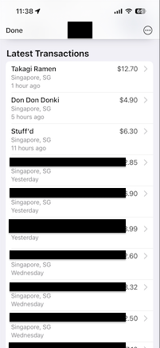
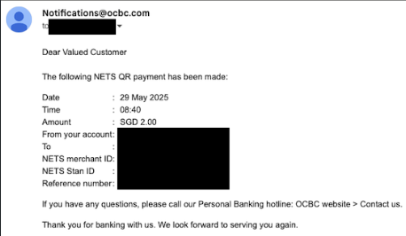

# Ingest scripts and extractors

A collection of scripts to extract and parse transactions from various sources.
Currently two types of data are supported:

1. Screenshots of transactions of a card in Apple Wallet app. Example:



2. Email notification from OCBC regarding PayNow/NETS QR Payment. Example:



## Scripts

### download_emails.py

Given an email address and password, download emails via IMAP and save parts that contain images or PayNow/NETS QR Payment information. Data is saved as image files or html files respectively.

Files are named in `YYYY-MM-DD_HHMMSS.ext` format, corresponding to the time screenshot or payment notification was sent.

#### Usage

```
python download_emails.py --email_address youremail@gmail.com --email_password yourpassword --output_dir downloaded_data_dir
```

Tips:
- For security reasons, use a dedicated email account that only contains transaction information. Consider configuring a forwarding rule to relay QR Payment notification emails to the dedicated email. Of course, some privacy risks still exist. Proceed with caution.
- Gmail requires the use of App Passwords instead of the regular password for access via IMAP.

### process_downloaded_data.py

This script is meant to process files generated by `download_emails.py`. Iterates over the files and applies the appropriate `Extractor` to parse transactions. File names must be in `YYYY-MM-DD_HHMMSS.ext` format. Saves transactions into a csv file while attempting to remove duplicates.

#### Usage

```
python process_downloaded_data.py --screenshots_dir downloaded_data_dir --csv_output_path transactions.csv
```
